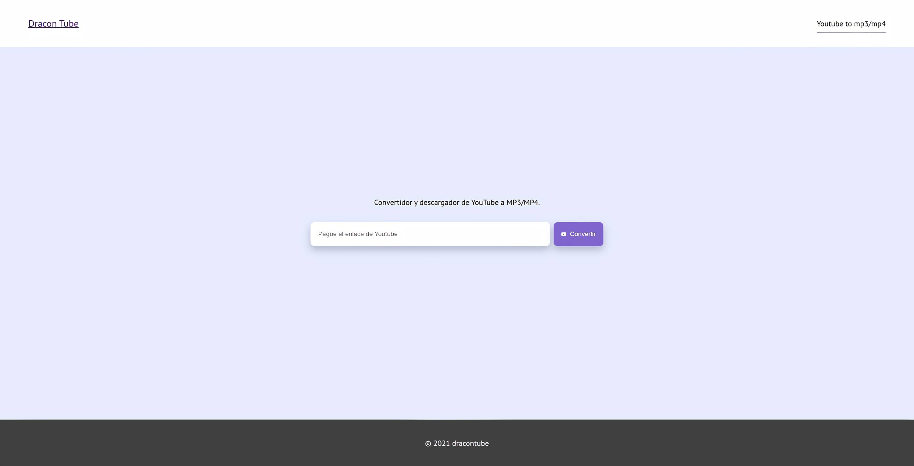

# Youtube Downloader

Using React, Vite, Axios, CSS Module, minireset.css and own API to search and convert videos from Youtube

## Preview



### Deploy

[Repository API URL](https://github.com/brandovidal/youtube-downloader-api)

[Web URL](https://tube.dracon.dev/)

### Scripts

Start App

```
yarn dev
```

Build App

```
yarn build
```
